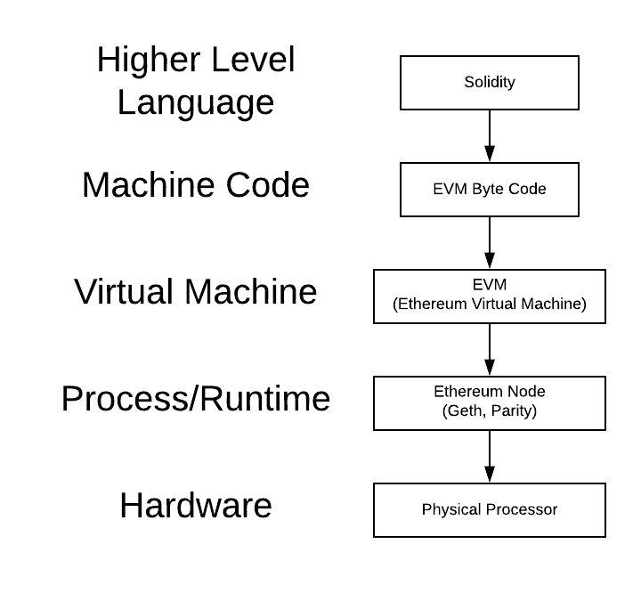

# Smart Contracts

* Computer programs that can run on a blockchain

* Allow credible transactions of digital assets under certain conditions without third parties

* Allow building completely decentralized applications (dApps) on top of blockchain

* Leverages Ethereum blockchain distributed computing platform which uses public and private keys mechanisms to ensure the confidentiality

* Uses Solidity to create and deploy smart contract in Ethereum


* Check out [Enterprise Ethereum Alliance](https://entethalliance.org/)

* Check out [State of the Dapps](https://www.stateofthedapps.com/)


<br>

## Terminology

* `Decentralized operation`: open-source code, autonomous operation, consensus of its users

* `Decentralized storage`: storage on a blockchain, cryptographically sealed

* `dApp`: An application stack that leverages one or many smart contracts on the Ethereum blockchain

* `Cryptographic cryptocurrency`: use of tokens for access and value contribution

* `Token generation`: tokens as proof of value, generated through a cryptographic algorithm

* `Web 3.0`: the evolution of the Internet to a decentralized environment powered by blockchain technologies


* `MetaMask`: a web browser extension that allows you to run an Ethereum decentralized application (dApp) right in your browser without running a full Ethereum node


    * The bridge between the Remix IDE in our browser and the blockchain we are trying to execute a smart contract on


* `Ganache`: a one-click Ethereum blockchain for dApp development 
    * you can prefund your addresses on localhost, deploy contracts, develop applications, and run tests

    * Set hostname as `127.0.0.1` (localhost) port `8545`

    * `automine`: when a transaction happens, the block is instantaneously processed so there is no wait time (unlike in reality)


* `Remix`: an online IDE and compiler for the Solidity smart contract language

    * allows you to write, compile and deploy Solidity smart contracts onto the Ethereum blockchain.

    * On deployment, set environment to Injected Web3 so that Remix can talk to MetaMask, which injects Web3 library to the browser and allows Remix to talk to the blockchain networks


* `Ethereum Virtual Machine(EVM)` is a sandboxed environment backed by a virtual stack and capable of performing calculations
    * Embedded within every Ethereum full node on the Ethereum network

<br>


## Tools

1) Add [MetaMask web browser extension](https://metamask.io/) to Chrome extension

2) Install [Ganache](https://www.trufflesuite.com/ganache)

3) [Remix](http://remix.ethereum.org/) - no installation is needed


<br>


## Ethereum wallet keys
* In Ethereum, the same keys can be used across any Ethereum network

* Addresses can have difference balances on each of the networks

* Regardless of the network (i.e., main net, Kovan, Ropsten, or a local blockchain), all of these networks use the same addresses and keys


<br>


## Structure



<br>


`Solidity` is the higher level object-oriented programing language used to write smart contracts on the Ethereum blockchain

* A language that is more easily understandable for humans than machine code

* Allows code to be written that is independent of a particular computer's hardware 

* Is strictly typed to increase efficiency and decrease cost

    * Allows for better error handling in code.

    * Contracts should not leave room for ambiguity.

    * Being upfront about data types and the size to store them results in less computational overhead/gas costs


<br>

`EVM machine code` consists of a list of instructions that the EVM will perform
    
* User pays a certain amount of gas for each instruction to get executed by the EVM
* Each computation has a different gas cost associated with it (unlike Bitcoin)

* contains a memory, storage, all of the essential parts of a physical computer but virtual, and sandboxed inside of your Ethereum node.

* Every Ethereum node runs the EVM, which is how all Ethereum nodes are able to process and validate transactions and smart contracts.

* The code executed in a virtual machine cannot affect the host machine directly

* The code can run anywhere the virtual machine can run


<br>


`Process/Runtime`

* The actual process that runs on the host machine.

* While each node can verify transactions within its own EVM, it takes multiple full nodes running their own EVMs to secure the network properly.

* Geth is one implementation of an Ethereum full node written in GO


<br>


`Hardware`

* Can be any machine that is capable of running the node software and connecting to the internet

* Blockchains are written in software


<br>

## Solidity

* Check out [Solidity documentation](https://solidity.readthedocs.io/en/v0.5.3/contracts.html)


* Defines the data types upfront

    * Allows the language to use the most optimal storage container for the data, thus saving space

    * This is important for smart contracts because it costs money to store data

    * Removes ambiguity
    
    * The Solidity compiler does not have to expend the resources figuring out what type the data is, thus less computational overhead/gas costs

    * Contracts should not leave room for ambiguity - they should be very precise and accurate

    * Types can be used by the compiler for error-checking

    * All types are set to 0 by default


<br>

* Different data types have a different gas cost associated with it

    * Addresses are a fixed size, so it is more cost-effective to use `address` type than a `string`, which uses a variable amount of storage space

    * An `int` stores positive and negative numbers

    * A `uint` only stores positive numbers

    * No decimals type in Solidity yet (2020)


<br>

* Keyword `memory` for `string` type
    
    * Strings are a more complex and thus more expensive data type than integers and addresses
    
    * The EVM requires you to specify where it is stored

    * You can store strings in `memory` and use less gas when you are passing them as a parameter to a function

    * Any any variable stored as `string` (no memory) is permanently written to the blockchain


<br>


* Keywords `public` or `private` in function definition

    * `public` means the function can be called from outside of the contract, either by users or other contracts
    
    * `private` means the function would only be callable from other functions in the contract


    ```
    function setInfo(address newAddressKey, bool isNewAccount, uint newBalance, string memory newClientName) public {

    address_key = newAddressKey;
    is_new_account = isNewAccount;
    balance = newBalance;
    client_name = newClientName;

    }
    ```

<br>

* No cost to pull data from blockchain

    * It only costs money to write data to the blockchain or perform calculations on things in memory
    


    ```
    function getInfo() public returns(address, bool, uint, string memory) {

    return (address_key, is_new_account, balance, client_name);

    }
    ```


<br>

* Setting `addresses` as `payable`

    * By setting an address or function as payable, we unlock special functions that allow us to capture and manage ether

    * A payable address is like a normal address type, except it allows the `.transfer` function to be called in order to send it Ether


<br>


* All smart contracts on Ethereum have **their own address** when deployed, and can store and send ether like a wallet

    * It is up to you to create functions that manage this ether properly

    * The contract can accept and hold the ether that we send by using the `deposit` function, and this is done by just adding the payable modifier

    * Notice that there is no parameter for the `deposit` function because you will use the remix interface to specify the `Value`

    * It can also send any amount of ether to any address that we specify in the `withdraw` function

    * Since we defined the amount variable as a uint256 (the smallest denomination of ether called wei), we must convert withdraw amount to an equivalent amount of wei for the parameter

    * If ether is sent to the contract without using the deposit function (sending ether directly to the contract's address), we can still capture the ether into the contract's wallet by specifying `external payable` fallback function

    * If we don't add this external payable fallback function, the ether directly sent to the contract address will be returned


<br>


* When an `if/else` is false, the code inside the if statement does not execute, but the contract as a whole continues to execute as if everything was successful, thus continuing to spend the gas that was allotted to the contract call


* Unlike the `if/else` when a `require` condition fails, the contract immediately ends execution, and the remaining gas is returned to the person that executed the contract

<br>

```
pragma solidity ^0.5.0;

contract JointSavings {
   
    address payable account_one;
    address payable account_two;


    // The address variables here are for tracking only, not calling .transfer
    // Add the keyword public automatically makes them a getter function

    address public last_to_withdraw;
    uint public last_withdraw_block;
    uint public last_withdraw_amount;

    address public last_to_deposit;
    uint public last_deposit_block;
    uint public last_deposit_amount;


    //Use constructor to avoid hardcoded values and reuse code

    constructor(address payable _one, address payable _two) public {
        account_one = _one;
        account_two = _two;
    }


    //Control when our contract is locked and unlocked
    // Use uint to store the current time in an integer format 
    uint unlock_time;
    uint fakenow = now;


    // Use fake time for development
    function fastforward() public {
        fakenow += 3 days;
    }


    function withdraw(uint amount) public {
       

        // check if the unlock time has passed   
        //require(unlock_time < now, "Account is locked!");
        require(unlock_time < fakenow, "Account is locked!");

        // check the person who sends the transaction is one of the account owners
        require(msg.sender == account_one || msg.sender == account_two, "You don't own this account!");


        // Check to avoid unnecessary gas when the variable doesn't need to be changed
        if (last_to_withdraw != msg.sender) {
            last_to_withdraw = msg.sender;
        }

        last_withdraw_block = block.number;
        last_withdraw_amount = amount;


        // If you withdraw 1/5 of the balance, lock account for 24 hours

        if (amount > address(this).balance / 5) {
            //unlock_time = now + 24 hours;
            unlock_time = fakenow + 24 hours;
        }    

        msg.sender.transfer(amount);

    }


    function deposit() public payable {

        if (last_to_deposit != msg.sender) {
        last_to_deposit = msg.sender;
        }

        last_deposit_block = block.number;
        last_deposit_amount = msg.value;

    }

    function() external payable {}
}
```


* All the above functions are publicly callable from the contract

* They all have an input that allows you to send the function parameters

* `uint` = 0 by default

* `block` accesses the current block's information

* `msg` refers to the current transaction that is executing the smart contract

* `msg.value` refers to the amount of Ether that was sent with the transaction

* `address(this).balance` shows the current balance of the contract

* In Ethereum, the accuracy of `now` will always fluctuate based on the average blocktime (15s)

* Timing-critical applications will need to use special contracts called "Oracles" that can provide the exact current time

* Always remember to calculate the new state BEFORE sending funds. Otherwise, something called a "re-entry" attack may be possible

* This constructor function will only run ONCE during the deployment of the contract and you will be able to pass the parameters during deployment 


* When you `withdraw` from the contract, you will see `0` ETH withdraw on MetaMask regardless how much WEI you are withdrawing. You will only see a value on MetaMask when sending Ether to a payable function (deposit)


<br>
<br>

## Tokenomics


### Tokens vs Coins

*Differences*:

* Tokens are often built on top of a blockchain platform
* coins (BTC, ETH, etc) are cryptocurrencies that usually have their own blockchain


*Similarities*:

* Both represent value

* Both utilize a blockchain on some level

* Both can have a fixed or infinite amount of supply, depending on the system

* Both can be used to implement a stablecoin

<br>


`Tokens` are used to represent an asset or utility on a blockchain platform


* Are programmed using smart contracts so they can be programmed to do many things besides just payments


* Can be traded globally without any additional infrastructure because they are blockchain-powered


* By tokenizing things, you can make representing and trading value very easy and efficient


* You can open up your crypto wallet to see all the various assets you own in a single place, digital and physical


* Business assets can easily be tracked and transferred, dramatically improving liquidity and auditability


* Items you purchase at a grocery store can be tokenized, allowing you to scan a code on your groceries to pull up the entire supply chain history of the items, so you know exactly where they came from


* Stablecoins are tokens designed to have stable value; unlike traditional cryptocurrencies, they are not as volatile since they are backed by fiat (government) currencies

* Stablecoins normally hold USD within bank accounts and then issue tokens backed by these dollars


<br>

### Popular tokens

* BAT - seeking to address fraud in advertising, basic attention is an open-source, decentralized ad platform that allows advertisers to pay website publishers for the attention of users.

* 0x - a protocol that allows the creation of decentralized crypto exchanges on the Ethereum blockchain using smart contracts for negotiation between users.

* Hedge - a platform that creates a market for knowledge on best trading practices, allows users to trade their current market analysis for an equivalent amount of value.

* Vechain - offers a Blockchain-as-a-Service (BaaS) platform called ToolChain. ToolChain offerers services like product lifecycle management, supply chain process control, data deposit, data certification, and process certification to enterprise companies like Walmart.

* Gemini Dollar (GUSD) - the first federally regulated stablecoin the Gemini dollar is issued by the Gemini Trust Company, LLC, a New York trust company. Each GUSD is backed by one USD.

* Maker Dao (Dai) -  a token but also a stablecoin, this means 1 Dai = $1. Instead of having a central company back the fiat, the MakerDAO converts Ether to the Dai stablecoin. This creates a 1:1 parity with the USD, without a central authority, just smart contracts!

* Golem (GNT) - a token that you use to pay for rentable computing power on the Golem network. It allows you to pay for computations that occur outside of Ethereum, like GPU access or other hardcore number-crunching jobs.


<br>
<br>

## Building a token

* Data Type `mapping` is a pair of types

    * Allows you to map address to uint, so you can set balances associated with addresses

    * There is no cap on how much we can store in `mapping`, but it is limited by gas prices and gas limits of the current state of the blockchain network

* Using simple `+=` or `-+` for token `uint` balances is vulnerable to the `integer underflow attack` and allows users to spend tokens they do not have

* Integer Underflow: When you subtract 1 from `uint` 0, the number becomes the maximum number possible (`uint` cannot be negative)

* Integer Overflow: When you add 1 to `uint` maximum number possible, the number becomes 0

* Leverage [OpenZeppelin](https://docs.openzeppelin.com/contracts/2.x/api/math) library to prevent integer underflow and overflow

    * It enables more secure and efficient Solidity code

    * It adds special functions to any object using the `uint` type, like `.add(), .sub(), .mul(), and .div()` that we can use instead of the `+, -, *, and /` operators

    * Make sure you replace every instance of a math operator like with the SafeMath alternatives

* `Remix` supports importing libraries straight from Github

* It is good practice to leverage this library by default, and the majority of smart contract developers do the same as it has prevented many tokens from being compromised


<br>

```
pragma solidity ^0.5.0;

import "github.com/OpenZeppelin/openzeppelin-contracts/blob/release-v2.5.0/contracts/math/SafeMath.sol"; // only works in Remix

contract ArcadeToken {
    
    // link the library to the uint type
    using SafeMath for uint;

    address payable owner = msg.sender;
    string public symbol = "ARCD";
    uint public exchange_rate = 100;

    mapping(address => uint) balances;

    function balance() public view returns(uint) {
        return balances[msg.sender];
    }

    function transfer(address recipient, uint value) public {
        // using .sub and .add prevents integer underflow
        balances[msg.sender] = balances[msg.sender].sub(value);
        balances[recipient] = balances[recipient].add(value);
    }

    function purchase() public payable {
        uint amount = msg.value.mul(exchange_rate);
        balances[msg.sender] = balances[msg.sender].add(amount);
        owner.transfer(msg.value);
    }

    function mint(address recipient, uint value) public {
        require(msg.sender == owner, "You do not have permission to mint tokens!");
        balances[recipient] = balances[recipient].add(value);
    }
}
```

<br>
<br>

## Building a token with reward system

* Solidity does not support decimals (as of 2020), you can use `basis points` to calculate rewards

* 1 basis point = 0.01%
* Calculate a percentage by using basis_points * some_number / 10000


```
pragma solidity ^0.5.0;

import "github.com/OpenZeppelin/openzeppelin-contracts/blob/release-v2.5.0/contracts/math/SafeMath.sol";

contract ArcadeToken {
    using SafeMath for uint;

    address payable owner = msg.sender;
    string public symbol = "ARCD";
    uint public exchange_rate = 100;
    uint public fee_rate = 25; // represents 25 basis points, which equates to 0.25%
    uint public reward_rate = 3; // 3 tokens for every wei spent

    mapping(address => uint) balances;

    function balance() public view returns(uint) {
        return balances[msg.sender];
    }

    function transfer(address recipient, uint value) public {
        balances[msg.sender] = balances[msg.sender].sub(value);
        balances[recipient] = balances[recipient].add(value);
    }

    function purchase() public payable {
        uint amount = msg.value.mul(exchange_rate);
        balances[msg.sender] = balances[msg.sender].add(amount);
        owner.transfer(msg.value);
    }

    function mint(address recipient, uint value) public {
        require(msg.sender == owner, "You do not have permission to mint tokens!");
        balances[recipient] = balances[recipient].add(value);
    }

    function spend(address payable recipient) public payable {
        uint fee = msg.value.mul(fee_rate).div(10000); // calculate 0.25% from basis points
        uint reward = msg.value.mul(reward_rate); // reward 3 points for every wei spent

        balances[msg.sender] = balances[msg.sender].add(reward); // add reward to sender point balance

        recipient.transfer(msg.value.sub(fee)); // send transaction with fee subtracted
        owner.transfer(fee); // send fee to RewardsToken owner
    }
}
```